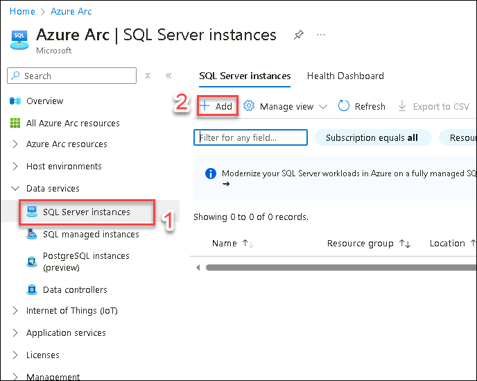
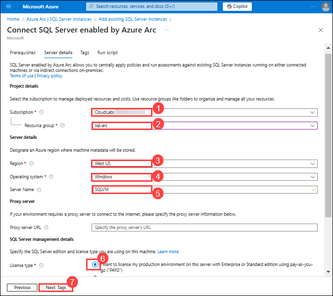
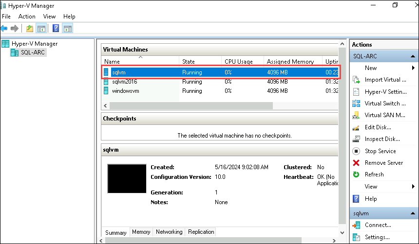
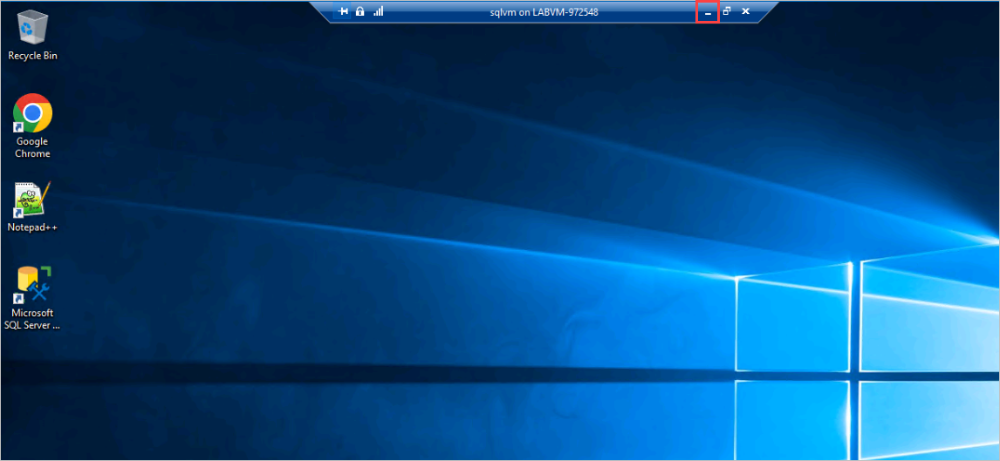
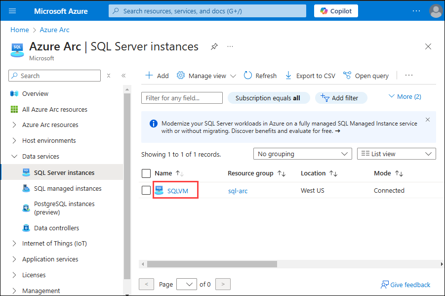
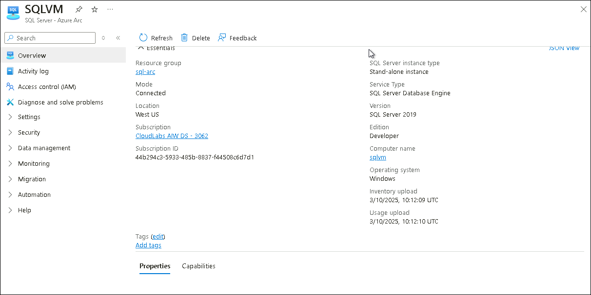

# Exercise 1: Onboard the On-prem SQLServer to Azure Arc-enabled SQL Server 

### Estimated Duration: 90 minutes
 
In this exercise, you will onboard an on-premises SQL Server to Azure Arc using Powershell and Azure Portal. First, you need to access the SQL Server virtual machine using Hyper-V Manager and log in to the Azure Portal from within the VM. Then, install the Azure Connected Machine Agent using PowerShell to prepare the server for registration. After that, run the Arc registration script to connect the on-prem SQL Server to your Azure environment. Finally, complete the setup by registering the SQL Server with Azure Arc, enabling centralized management and monitoring through the Azure Portal.

## Lab Objectives

In this lab, you will complete the following tasks:

- Task 1: Log in to Azure Portal in SQL Server via Hyper-V Manager
- Task 2: Register Azure Arc-enabled SQL Server
 
## Task 1: Log in to Azure Portal in SQL Server via Hyper-V Manager 

1. In the LabVM click on **Azure Portal** from the desktop to open, from the search bar at the top search for **SQL Server(1)** and then select **SQL Server - Azure Arc** **(2)**.
  
    
    
1. From the left pane on Azure Arc |SQL Server instances, under Data services select **SQL Server instances**, click on the **+ Add (2)** to create the **SQL Server- Azure Arc (1)**.  
  
    
    
1. In the Add existing SQL Servers instances page, click on **Connect SQL Server instances**. 
 
    
    
1. In Connect SQL Server enabled by Azure Arc under the Prerequisites tab. You can explore the page and then click on the **Next: Server details** from the bottom. 
     
   > **Note**: We have already completed the prerequisite part for you.  
     
    
    
1. In the **Server details** tab, enter the details below and click on **Next: Tags (7)**:
   
     - **Subscription**: Select the default subscription. **(1)**
     - **Resource group**: Select **sql-arc** from dropdown list. **(2)**
     - **Region**: **<inject key="Region" enableCopy="false"/>(3)**
     - **Operating system**: Select **Windows**. **(4)**
     - **Server Name**: Enter **SQLVM** **(5)**
     - **License Type**: Select **I want to license my production environment on this server with Enterprise or Standard edition using pay-as-you-go ("PAYG")(6)**
      
      
         
1. In the tags tags keep it defaut and click on **Next: Run script**.

     
  
1. In the **Run script** tab, explore the given script under Download or copy the following script, copy the script by clicking **Copy to Clipboard** paste the code into the notepad. We will be using this PowerShell script to **Register Azure Arc enabled SQL Server** later.  
       
       

1. Minimize the Browser window.  

1. In the **LABVM**, on the **Windows Search bar** ,search for **Hyper-v** and select **Hyper-V Manager**. 
 
       
 
1. From the left pane select **SQL-ARC** to connect with the Local Hyper-V server. 
 
       
 
1. On the Hyper-V manager, under Virtual Machines you will find multiple guest virtual machines available. Open **sqlvm** by double clicking on **sqlvm**.
 
        

   >**Note**: Please start the **sqlvm** if it is stopped state.
 
1. Connect to sqlvm box, and then click on the **Connect** button. 
 
       
 
1. Type password **demo@pass123** and press **Enter** button to login. Then, you can resize the sqlvm window size at your convenience. 
 
       
             
## Task 2: Register Azure Arc-enabled SQL Server
  
1. From the start menu of the SQL VM, search for **PowerShell (1)**, right-click on **Windows PowerShell ISE (2)** and select **Run as Administrator (3)**. 
  
    
   
1. In Windows PowerShell ISE, click on **Show Script Pane**. 
  
            
 
1. The script you copied on **step 7 of task 1** must be pasted in **Script Pane (1)** and clicked on **Run Script (2)**. 
 
      
      
1. After running the command, you will see some outputs which show that the script started running. 
   
     
 
1. Copy the **authenticate code**. 
 
     
 
1. In Hyper-v VM, use a web browser to open the page **https://microsoft.com/devicelogin**, enter the **authenticate code (1)** and click on **Next (2)**.  
 
     
  
1. On the **Sign in** tab, You're signing in to **Microsoft Azure Cross-platform Command Line Interface**. Enter the following **Email/Username (1)** and then click on **Next (2)**.  
   * Email/Username: <inject key="AzureAdUserEmail"></inject> 
   
       
    
1. Now, enter the **Password (2)** that you have already received for the above account, and click on **Sign in (2)** 
      
   * Password: <inject key="AzureAdUserPassword"></inject> 

      
      
1. Are you trying to sign into Microsoft Azure CLI? Click on **Continue** and minimize the Browser window. 
 
     
 
1. In 5-10 minutes, you will see that the script execution is completed. Make sure that you see the following output: ```SQL Server is successfully installed``` 
 
     

1. **Minimize** the sqlvm on SQL-ARC Hyper-V.   

     

1. Bring back the browser window where you had opened Azure Portal and search for **SQL Server -Azure Arc**. If you are already on that page, you will need to click on the Refresh button. On that page, you will see one resource **SQLVM** that we just created using the PowerShell script in the previous step. 
 
     

    > **Note**: If you are not able to view **SQLVM** SQL Server instances wait for 5 minutes and keep refreshing the page.
   
1. Select the **SQLVM** resource and now you can see the dashboard of **SQLVM** SQL Server -Azure Arc from Azure Portal. 
 
        

    <validation step="f00aaa9f-7a98-4314-9310-a1fcd61130aa" />

## Summary

In this exercise, you onboarded an on-prem SQL Server to Azure Arc using PowerShell commands to Azure Portal. 

### You have successfully completed the lab. Click on **Next >>** to procced with next exercise.
