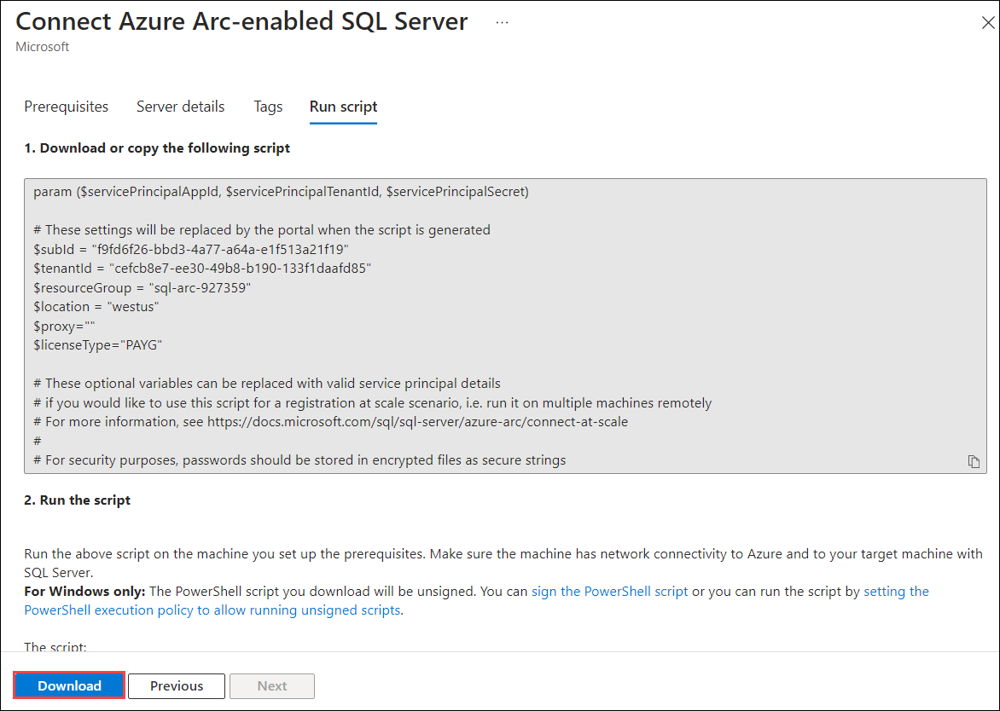

# HOL1: Azure Arc enabled SQL Server

In the last excercise, you have seen how to enable security measures and monitoring for Arc enabled servers. In this exercise, you will onboard SQL Server to Azure Arc using Azure Portal and PowerShell commands.

## Task 1: Login To Azure Portal

1. Navigate back to Azure Portal which you have already opened in the previous exercises.
      
1. Click on the search blade at the top and search for ```SQL Server```, select **SQL Server - Azure Arc**.
 
   
   
1. Click on the **Add** button to create the **SQL Server- Azure Arc**. 
 
   
   
1. In Adding existing SQL Servers instances page, Click on **Connect Servers**.

   
   
1. You will now see the prerequisite page. You can explore the page and then click on the **Next: Server details** option.
    
   > **Note**: We have already completed the prerequisite part for you. 
    
   
   
1. On the **Server Details** blade, enter the below details.
 
   - Subscription: Leave default
   - Resource group: Select **azure-arc** from dropdown list.
   - Region: Select same region as the Resource group.
   - Operating Systems: Select **Windows**.
   - License Type: Select **Paid - Standard or Enterprise edition license with Software Assurance or SQL Subscription**.

     Now, click on the **Next:Tags** button.
   
   
   
1. Leave the default for tags blade and click on **Next: Run Script** button.
 
1. On the **Script** blade, explore the given script. We will be using this PowerShell script to **Register Azure Arc enabled SQL Server** later.
  
   
   
## Task 2: Register Azure Arc enabled SQL Server.

1. Minimize the Azure Portal Browser window. 

1. From the desktop of your **LabVM/ARCHost VM**, double click on **Windows PowerShell** icon to open it.
 
   
  
1. Then, run the below command to change the directory to where the script gets downloaded.
 
   ``` 
   cd .\Downloads
   
   ```

1. After changing the directory to **Lab files**, run the command given below:

   ```
   .\RegisterSqlServerArc.ps1
   ```
     
1. After running the command, you will see some outputs which shows that the script started running.
   > **Note** : If script fails to execute. Please run it again. 

   
  
1. In 5-10 minutes, you will see that the script execution is completed. Make sure that you see the following output: ```SQL Server - Azure Arc extension is successfully installed```

   
  
1. Bring back the browser window where you had opened Azure Potal and search for **SQL Server -Azure Arc**. If you are already in that page, you will need to click on Refresh button. In that page, you will see one resource **SQLVM** that we just created using the PowerShell script in the previous step.

   
  
1. Select the **SQLVM** resource and now you can see the dashboard of **SQLVM** SQL Server -Azure Arc from Azure Portal.

      
   
