# Exercise 2: Onboard the On-prem SQLServer 2016 to Azure Arc-enabled SQL Server 

### Estimated Duration: 90 minutes
 
In this exercise, you will onboard an on-prem SQL Server to Azure Arc using PowerShell commands to Azure Portal, enable Best practices assessment and Microsoft Defender for SQL.

## Lab Objectives

You will be able to complete the following tasks:

- Task 1: Log in to Azure Portal in SQL Server via Hyper-V Manager
- Task 2: Register Azure Arc-enabled SQL Server
- Task 3: Enable Best practices assessment
- Task 4: Enable Microsoft Defender for SQL
 
## Task 1: Log in to Azure Portal in SQL Server via Hyper-V Manager 

1. In the Azure portal, click on the search tab at the top and search for **SQL Server(1)**, then select **SQL Server - Azure Arc(2)**. 
  
    
    
1. Click on the **+ Add** to create the **SQL Server- Azure Arc**.  
    
1. In the Adding existing SQL Servers instances page, click on **Connect SQL Servers instances**. 
 
   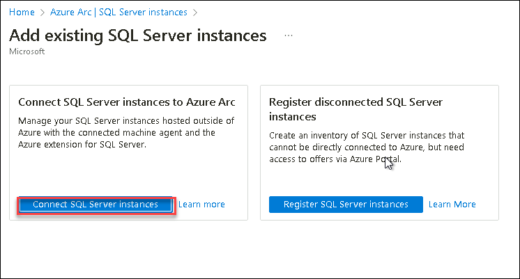 
    
1. You will now see the Prerequisites tab. You can explore the page and then click on the **Next: Server details**. 
     
   > **Note**: We have already completed the prerequisite part for you.  
     
   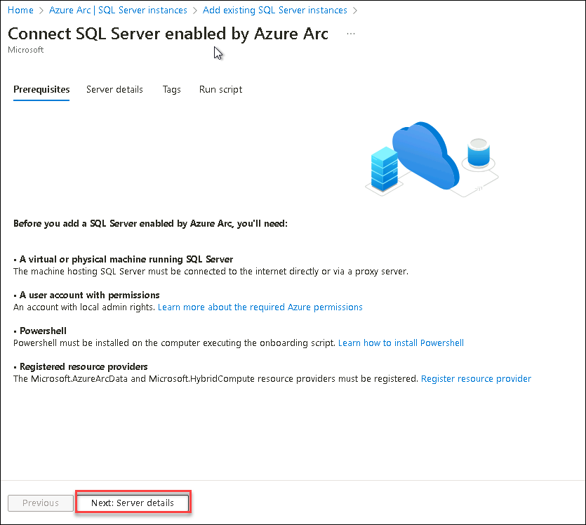 
    
1. On the **Server Details** tab, enter the details below. 
  
     - **Subscription**: Select the default subscription. **(1)**
     - **Resource group**: Select **sql-arc** from dropdown list.  **(2)**
     - **Region**: **<inject key="Region" enableCopy="false"/>**.  **(3)**
     - **Operating Systems**: Select **Windows**.  **(4)**
     - **Server Name**: Enter **SQLVM2016** **(5)**
     - **License Type**: Select **I want to license my production environment on this server with Enterprise or Standard edition using pay-as-you-go ("PAYG")**.  **(6)**
     - Now, click on the **Next: Tags (7)** button. 
    
   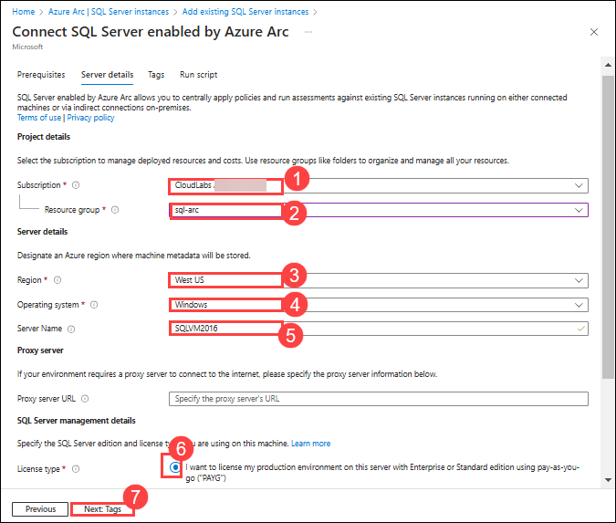 
    
1. In the Tags tab keep it default and click on **Next: Run script**.

   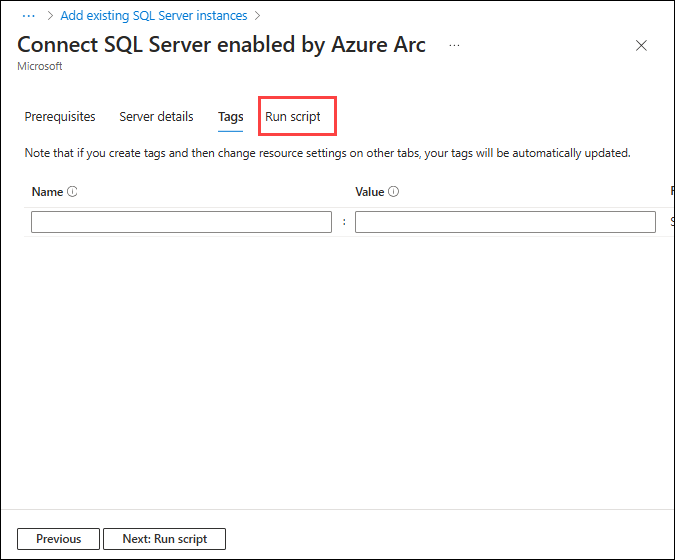
  
1. In the **Run script** tab, explore the given script under **Download or copy the following script**. Then copy the script by clicking **Copy to Clipboard**, paste the code into the notepad. Later we will be using this PowerShell script to **Register Azure Arc enabled SQL Server**.  
       
      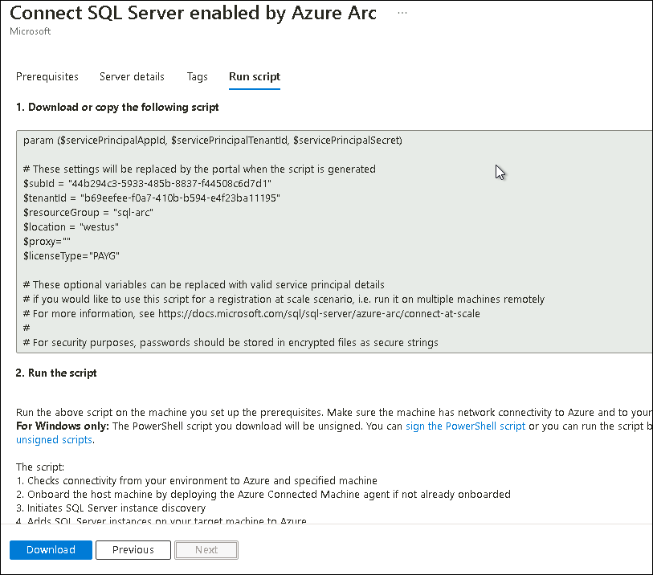 

1. Minimize the Browser window.  

1. In the **LABVM**, open the **Start menu** and search for **Hyper-V**. Select **Hyper-V Manager**. 
 
       
 
1. Then, you need to Select **SQL-ARC** to connect with the Local Hyper-V server. 
 
      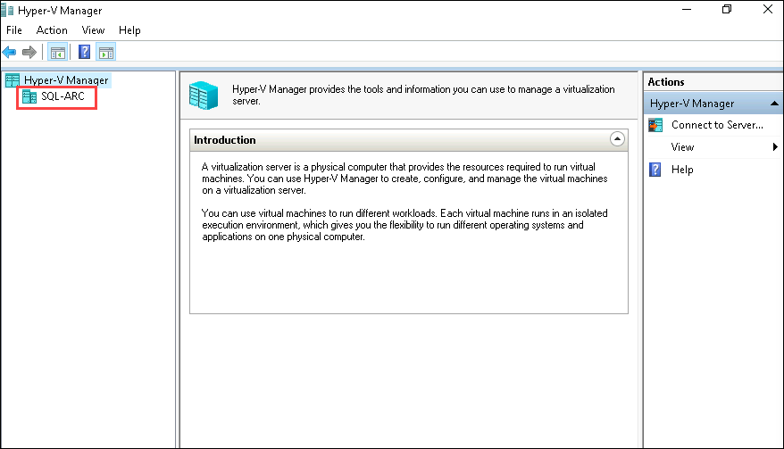 
 
1. On the Hyper-V manager, under Virtual Machines you will find multiple guest virtual machines available. Open **sqlvm2016** from the Hyper-V Manager by double clicking on **sqlvm2016**.
 
      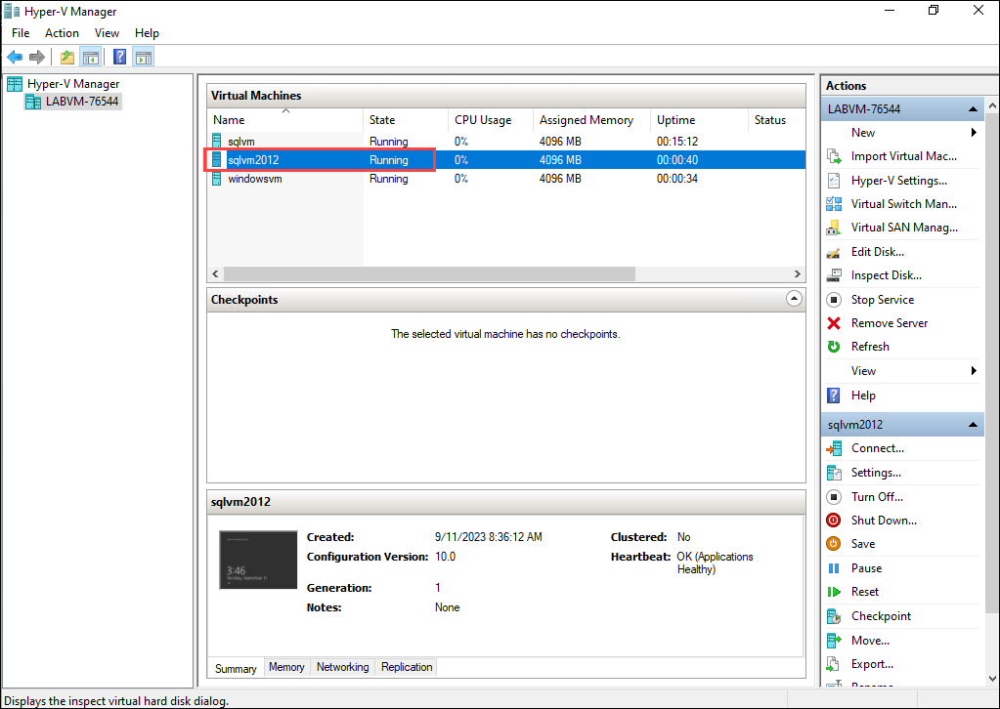  

   >**Note**: Please start the **sqlvm2016** if it is stopped state.
 
1. In the pop up Connect to the sqlvm2016 , and then click on the **Connect**. 
 
       
 
1. Enter the password **demo@pass123** and click on **Enter** button to login. Feel free to resize the sqlvm window as your convenience. 
 
      

## Task 2: Register Azure Arc-enabled SQL Server

 In this you will be registering an Azure Arc-enabled SQL Server connects your on-premises SQL Server instance to Azure for centralized management. 
1. From the start menu of the sqlvm2016, search for **powerShell (1)**, and right click on **Windows PowerShell ISE (2)** and select **Run as administrator (3)**.
  
   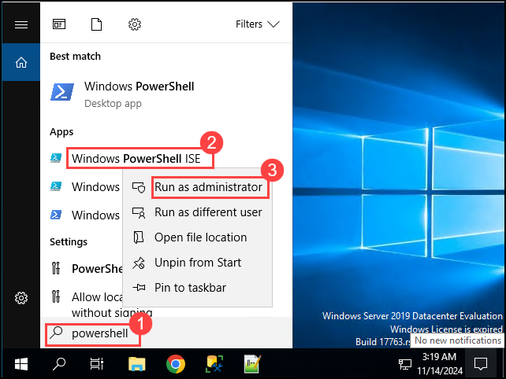 
   
1. In Windows PowerShell ISE, click on **Show Script Pane**. 
  
            
 
1. Paste the script which was copied in **Task 1 Step 7** in **Script Pane(1)** and click on **Run Script (2)**. 
 
      
      
1. After running the command, you will see some outputs which show that the script started running. 
   
     
 
1. Copy the **authenticate code**. 
 
     
 
1. In Hyper-v VM, use a web browser to open the page **https://microsoft.com/devicelogin**, enter the **authenticate code (1)** and click on **Next (2)**.  
 
    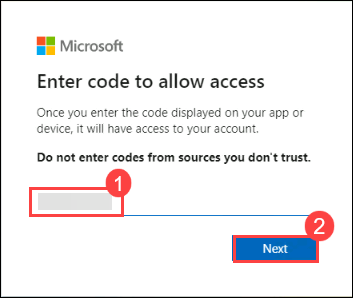 
  
1. On the **Sign in** tab, You're signing in to **Microsoft Azure Cross-platform Command Line Interface**. Enter the following **Email/Username (1)** and then click on **Next (2)**.  
   * Email/Username: <inject key="AzureAdUserEmail"></inject>
   
       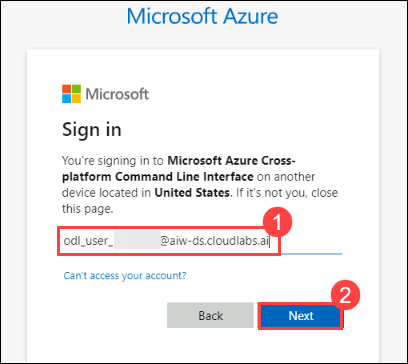
    
1. Now, enter the **Password (1)** that you have already received for the above account and click on **Sign in (2)** 
      
   * Password: <inject key="AzureAdUserPassword"></inject> 

      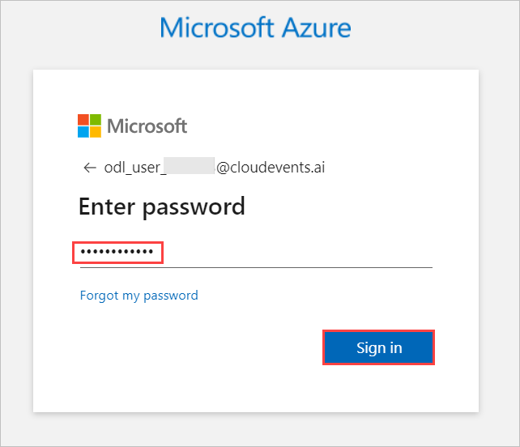
      
1. Are you trying to sign into Microsoft Azure CLI? Click on **Continue** and minimize the Browser window. 
 
     
 
1. In 5-10 minutes, you will see that the script execution is completed. Make sure that you see the following output: ```SQL Server is successfully installed``` 
 
     

1. Minimize the sqlvm2016 on SQL-ARC VM.   **check ss**

    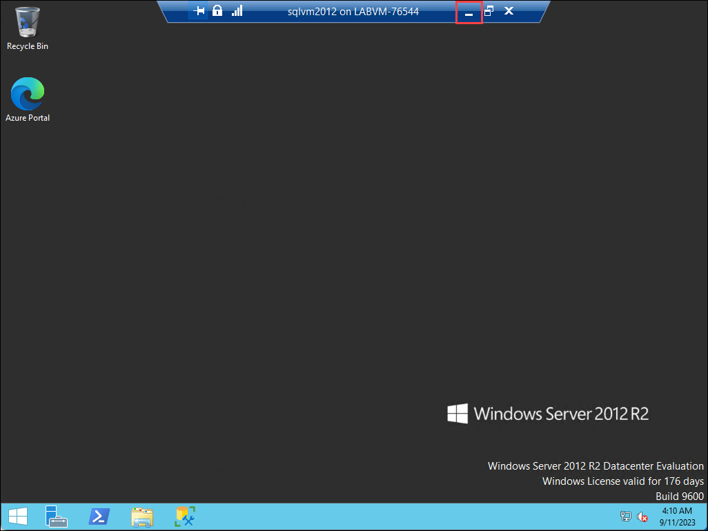

## Task 3: Enable Best practices assessment

The task enables best practices assessment for an Azure Arc-enabled SQL Server by linking it to a Log Analytics workspace. This allows us to analyze the SQL Server configuration and provide health and optimization recommendations.

1. Navigate to the browser tab where the **Azure Portal** is open and search for **SQL Server - Azure Arc**.
   
1. Click on **SQL Servers instances** **(1)** under **Data Service** section from left-menu and select the **SQLVM2016_CB2016SQLSERVER** **(2)** instance. 

   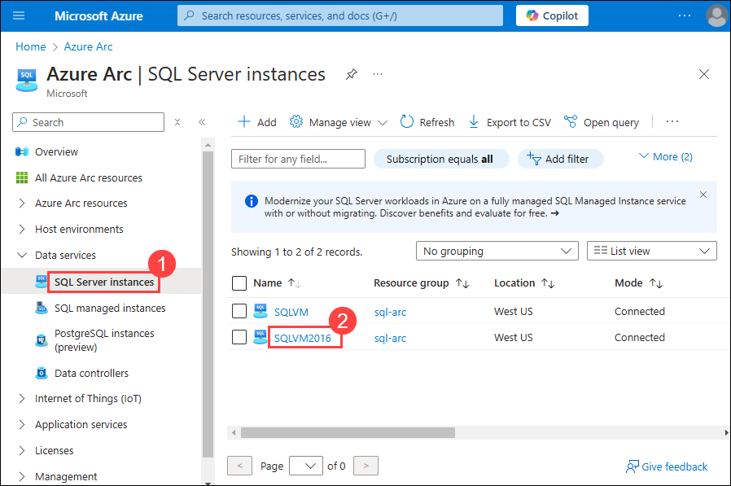

   > **Note**: If you are not able to view **SQLVM2016_CB2016SQLSERVER** SQL Server instances wait for 15-20 minutes and keep refreshing the page.

1. Click on **Best practices assessment(1)** under **Settings** section from left-menu, from Log Analytics workspaces select the **Arc-SQL-workspace-<inject key="Deployment ID" enableCopy="false"/>(2)** from drop-down, and click on **Enable assessment(3)**.
   
    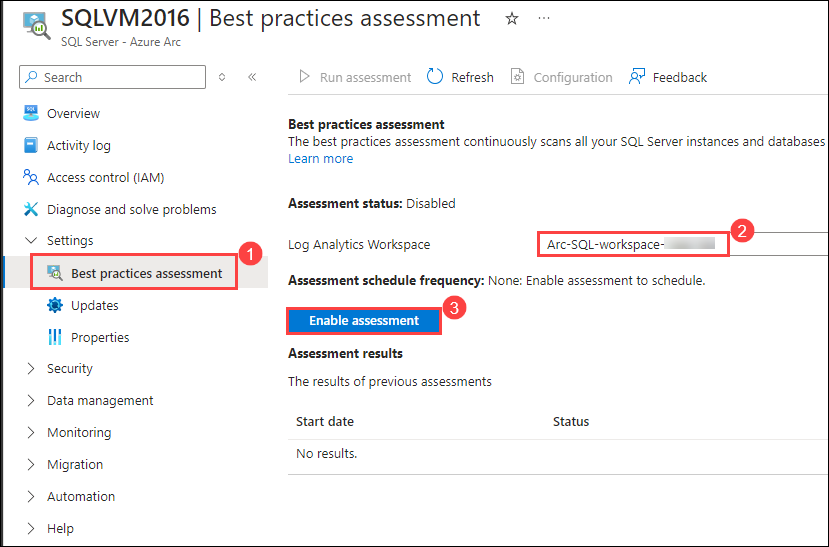
   
   > **Note**: Please wait while assessment settings are being refreshed. It will initiate and redirect to the deployments page.   

1. Once the deployment is completed move back to the previous tab **SQL Server - Azure Arc** by clicking on **X** from the top right corner page of the deployments page. Once you are in **SQLVM2016_CB2016SQLSERVER | Best practices assessment** tab, click on **Run assessment**.

    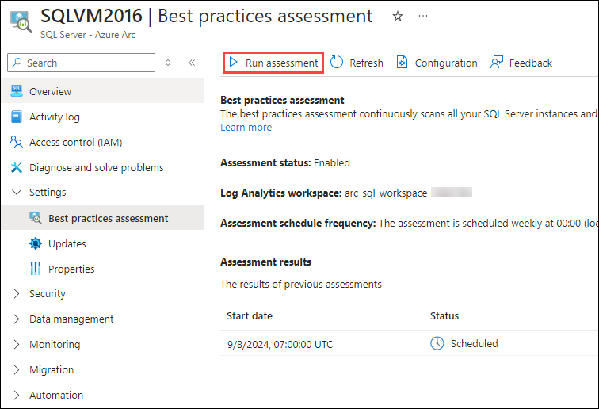

1. Click on the **Refresh** button until assessment status changes to **Partially Succeeded**. It may take up to 5 to 10 minutes.

   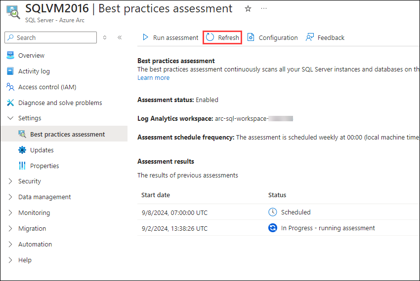

1. Once the assessment results status changes to **Partially Succeeded** or **Succeeded** , click on the **start date** to view results. 

   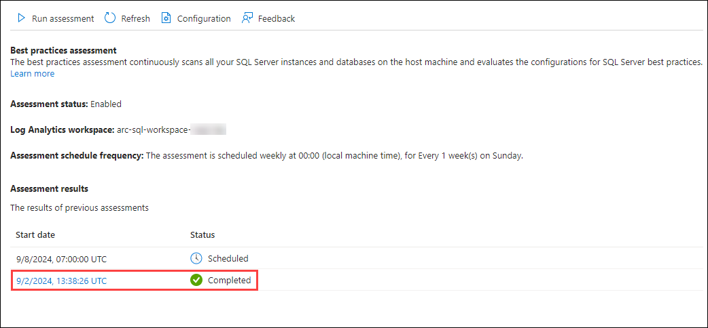***ss***

1. On the **SQL best practices assessment results** page you will able to view and explore the assessment result.

   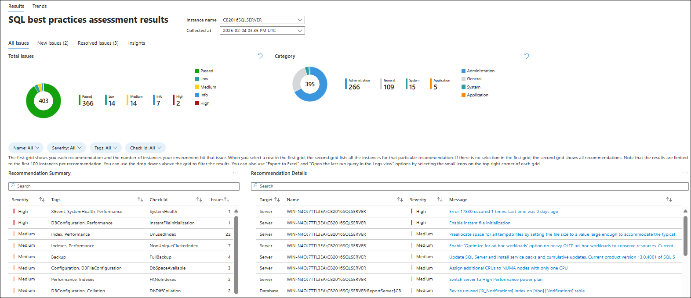

## Task 4: Enable Microsoft Defender for SQL

1. Navigate to the previous tab **SQLVM2016_CB2016SQLSERVER | Best practices assessment** by click on **X**, then click on **Microsoft Defender for Cloud** **(1)** under **Security** section from left menu, and click on **Enable** **(2)** button.

   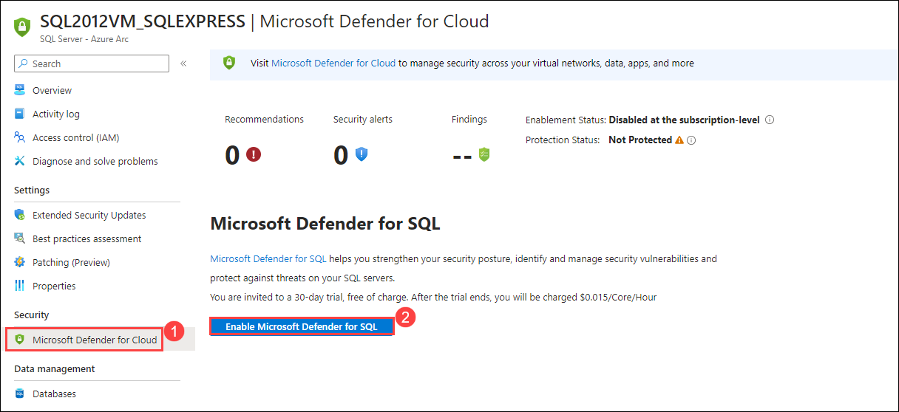

   > **Note:** Skip this step if Microsoft Defender for Cloud is already enabled for your subscription.

1. On **Microsoft Defender for Cloud** page, click on **Environment settings** **(1)** under **Management** from the left menu and expand the **Tenant root group** **(2)**, click on **eclipse** **(3)** button next to your subscriptions, and click on **Edit settings** **(4)**.

   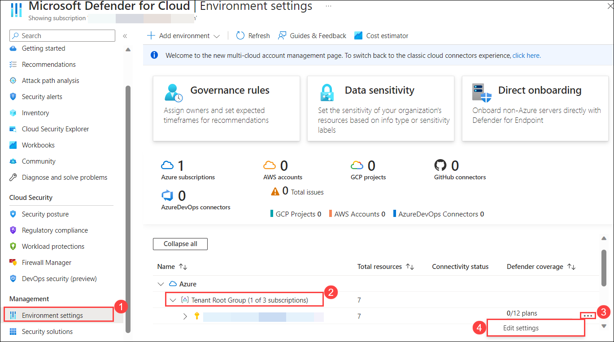

1. On **Settings | Defender plans** page, set the toggle button next to **Databases** to **On** **(1)** and then click on **Save** **(2)**.

   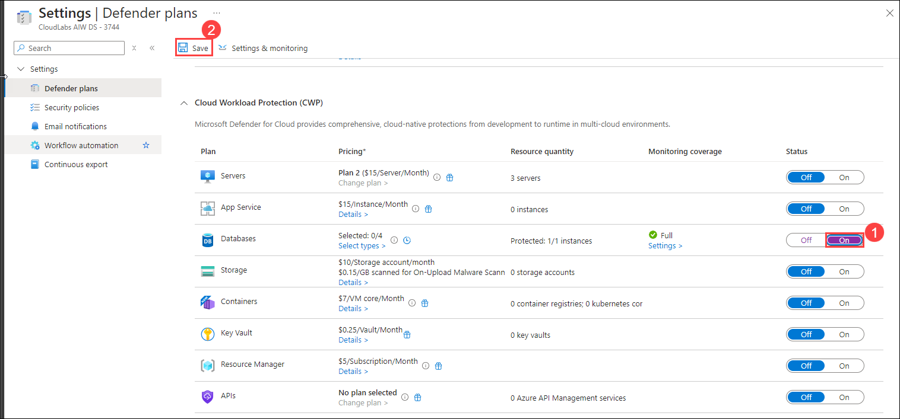 

1. Navigate to **SQLVM2016_CB2016SQLSERVER | Microsoft Defender for Cloud**, observe that the **Recommendations** and **Security incidents and alerts** are populated.**ss**

   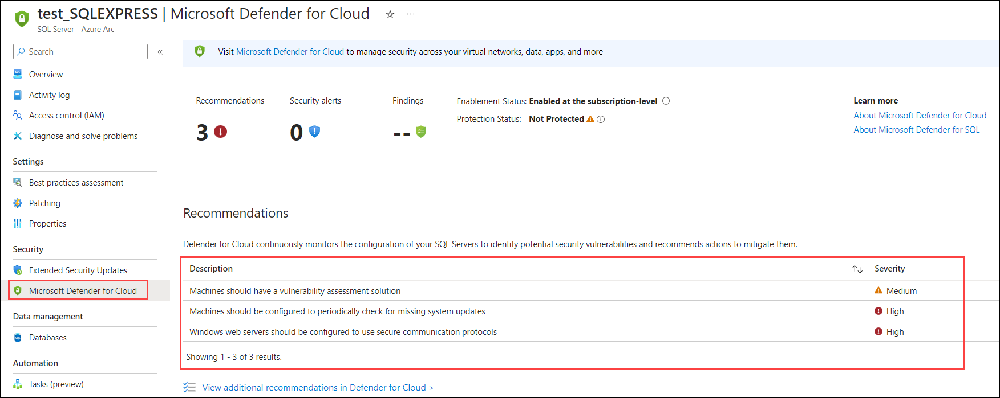

   > **Note**: It might take up to 24 hours for **Recommendations** and **Security incidents and alerts** to populated.

## Summary

In this exercise, you onboarded an on-prem SQL Server to Azure Arc using PowerShell commands to Azure Portal, enabled Best practices assessment and Microsoft Defender for SQL.

### You have successfully completed the lab. Click on **Next >>** to procced with next exercise.
