# Exercise 3: Create a Single pane of glass-managed solutions with Azure Arc 

### Estimated Duration: 60 minutes

In this exercise, you will configure a unified management dashboard using Azure Arc and Azure Monitor, creating a "single pane of glass" view for overseeing and managing all onboarded SQL Server instances from a centralized interface.

## Lab Objectives

You will be able to complete the following tasks:

- Task 1: Create a Single Pane of Glass Dashboard
- Task 2: Adding Resource Graph Grid Tiles - Servers
- Task 3: Adding Resource Graph Grid Tiles - Server by location Chart
 
## Task 1: Create a Single Pane of Glass Dashboard 

This task involves creating a centralized dashboard in the Azure Portal to monitor multiple resources from a single view. It provides a unified interface to visualize metrics, alerts, and insights across services.
 
1. Navigate back to the Azure Portal, which you have already opened in the previous exercises. 
 
2. In the Azure portal, Select **Dashboard** on the navigation pane from the top left.   

   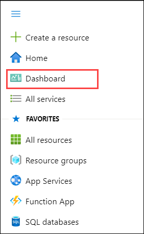  
 
3. In the My Dashboard page, click **+ Create**. 
 
    
     
4. In the Create a dashboard page, select **Create a custom dashboard**. 
 
   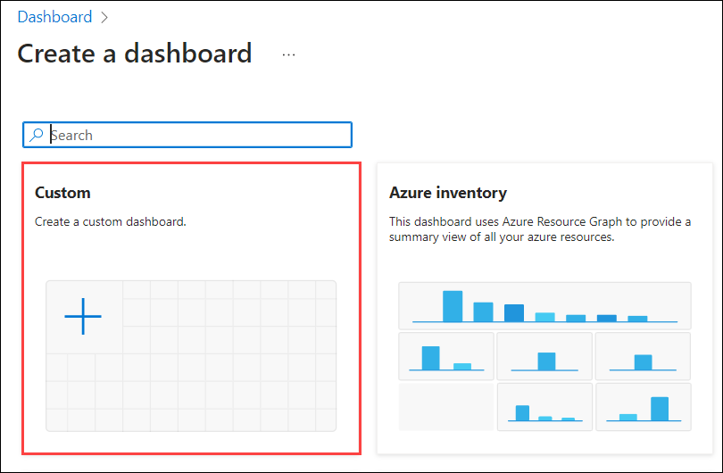 
 
## Task 2: Adding Resource Graph Grid Tiles - Servers

In this task, we will run an Azure Resource Graph query to list all SQL Servers, including Azure Arc-enabled and native Azure SQL Servers, where the results are pinned as a tile on the dashboard.
 
1. On the Right side of the custom dashboard page, under **Tile Gallery** search for **Resource graph grid tile (1)**, select **Resource graph grid tile (2)**, click on   the **Add (3)** button, then click on **Save (4)**. 
 
    
     
2. In My Dashboard page, under **Resource graph grid tile** click on **Configure tile**.
 
   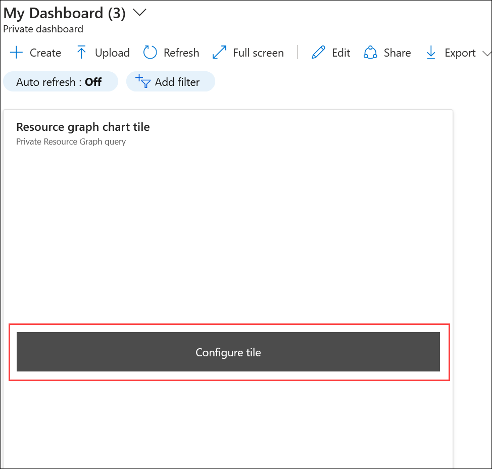  
     
3. Minimize the Azure Portal Browser window. 
  
4. In the Windows Search bar from the LABVM, search for **File Explorer** and select it.

5. Navigate to `C:\LabFiles\Azure-Arc-enabled-SQL-Server-main\lab-files`. 
  
     
  
6. Open the **Servers** script file by right-clicking on the file, select **Open with**, then select **Notepad** and click on **OK**. 
 
   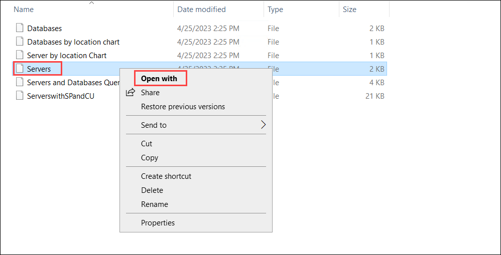
     
   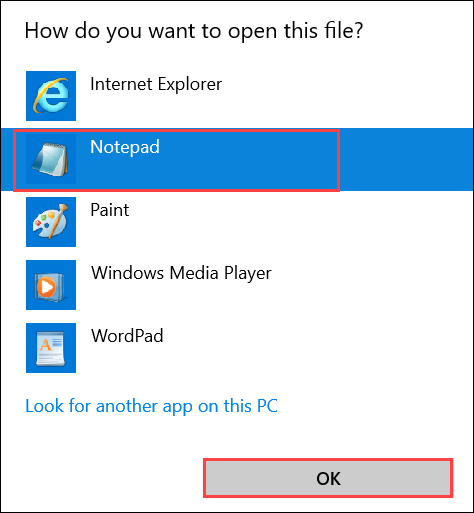  
     
7. Copy the SQL query from the **Servers** file, and overwrite the sample query with the Servers query in the **Dashboard query section**. 
 
   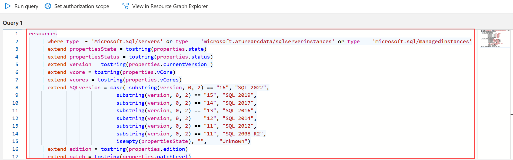  
     
8. Click on **Run query (1)**, you should see something like the below with the SQL Servers you installed, the **Azure Arc SQL Agent** as well as **Azure SQL Servers** ** (2)** running in Azure and update the tile in the dashboard by selecting **Update pinned part on dashboard (3)**. 
   
   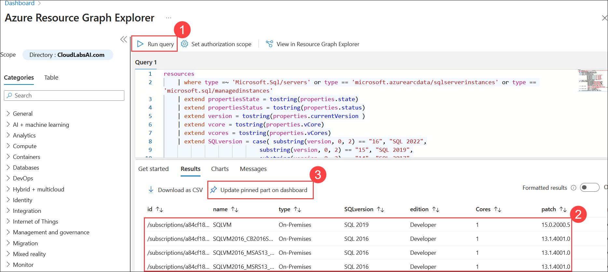 
          
## Task 3: Adding Resource Graph Grid Tiles - Server by location Chart

In this, you will add a Resource Graph Grid tile that visualizes the number of servers by their location in a chart format. It helps quickly identify the distribution of Azure and Arc-enabled servers across regions on the Azure dashboard.
 
1. In Dashboard page, click on **Edit**, under **Tile Gallery** search for **resource graph chart tile (1)**, select **Resource graph chart tile (2)**, click on **Add     (3)** then click on **Save (4)**. 
 
   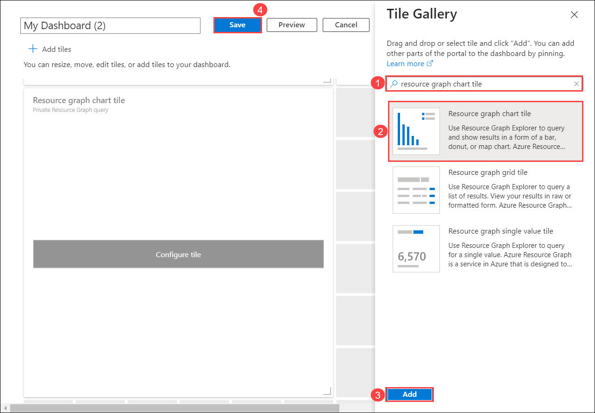 
     
2. In My Dashboard page, under **Resource graph chart tile** click on **Configure tile**. 
 
     
     
3. Minimize the Azure Portal Browser window. 
  
4. In the Windows Search bar of the LABVM, search for **File Explorer** and select it.

5. Navigate to `C:\LabFiles\Azure-Arc-enabled-SQL-Server-main\lab-files`.

   
   
6. Open the **Server by location Chart** script file by right-clicking on the file, select **Open with**, then select **Notepad** and click on **OK**.

   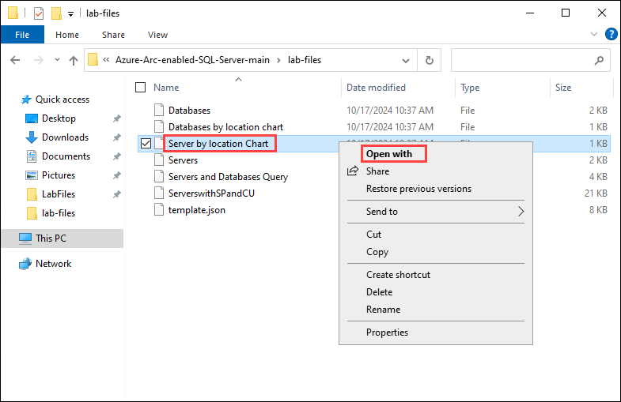

      
      
7. Copy the SQL query from the **Server by location Chart** file, and overwrite the sample query with the Servers query in the Dashboard query section.  

   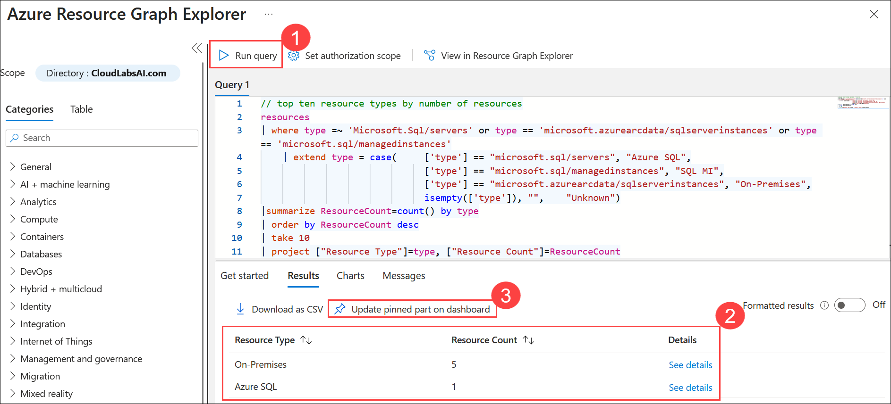
 
8. Click on **Run query (1)** and update the tile to **Charts (2)** and select **Bar chart (3)** in the dashboard then select **Update pinned part on dashboard (4)**. 
     
     
 
9. Your dashboard should look like the one below. You can resize each individual tile and arrange them however you like on your new dashboard by clicking edit at the top  of the dashboard. 
     
   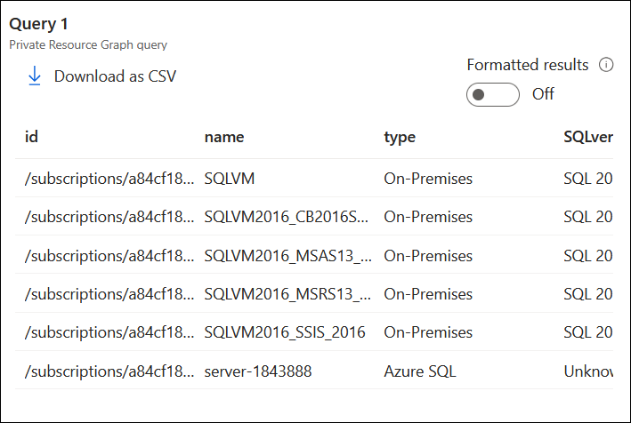 
     
   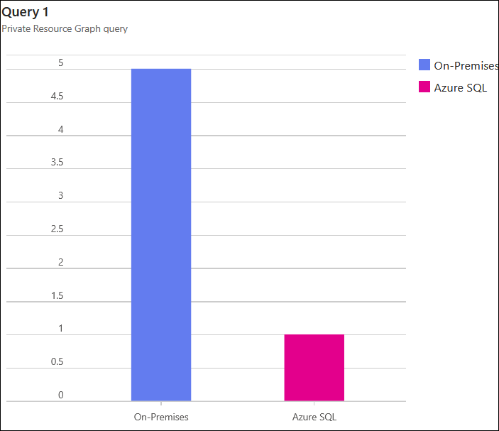   

10. This repo [https://azure.github.io/az-hop/user_guide/files.html](https://github.com/markm555/SQLSPOG) contains all the scripts. The scripts are regularly updated.

## Summary

In this exercise, you created a single pane of glass dashboard using Azure Arc and Azure Monitor by adding Resource Graph Grid Tiles for SQL servers and server by location chart.

### You have successfully completed the lab!

## Conclusion

By the end of the **Azure Arc enabled SQL Servers - Single Pane of Glass**, you will have successfully onboarded both modern and legacy on-premises SQL Server instances, including SQL Server 2016, into Azure Arc. This integration establishes a consistent, centralized management experience directly from the Azure portal. With the addition of a unified Azure Monitor dashboard, organizations gain a single pane of glass for visibility, monitoring, and control of all their SQL Server environments—whether on-premises or in the cloud. Together, these capabilities not only simplify administration but also strengthen operational oversight, ensuring scalability, security, and efficiency in hybrid data landscapes.
