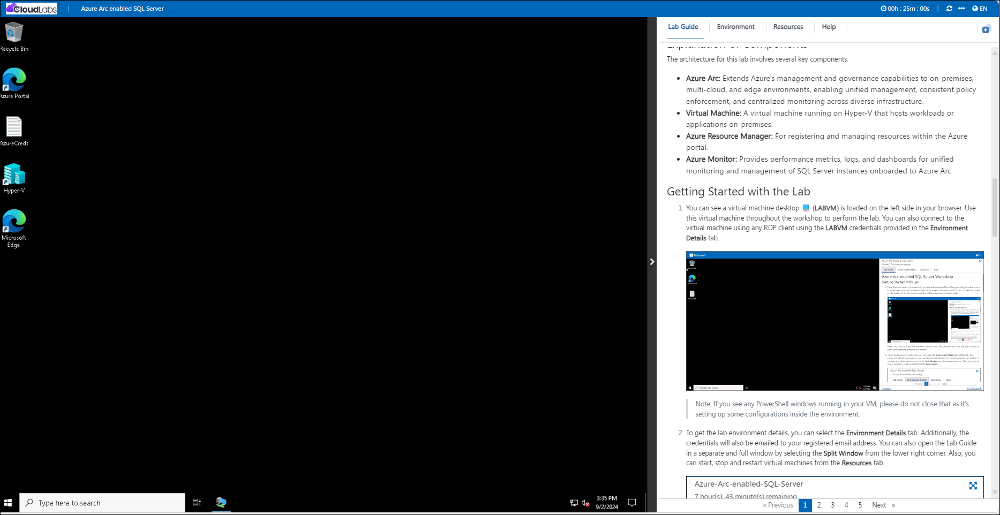
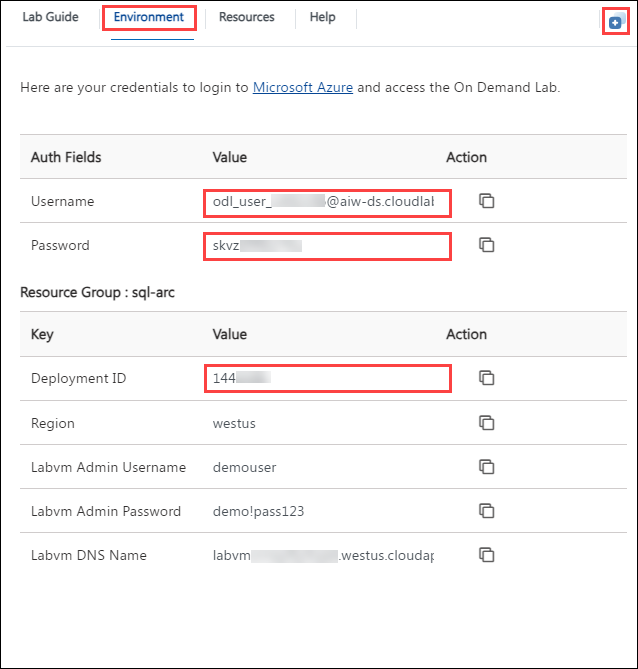
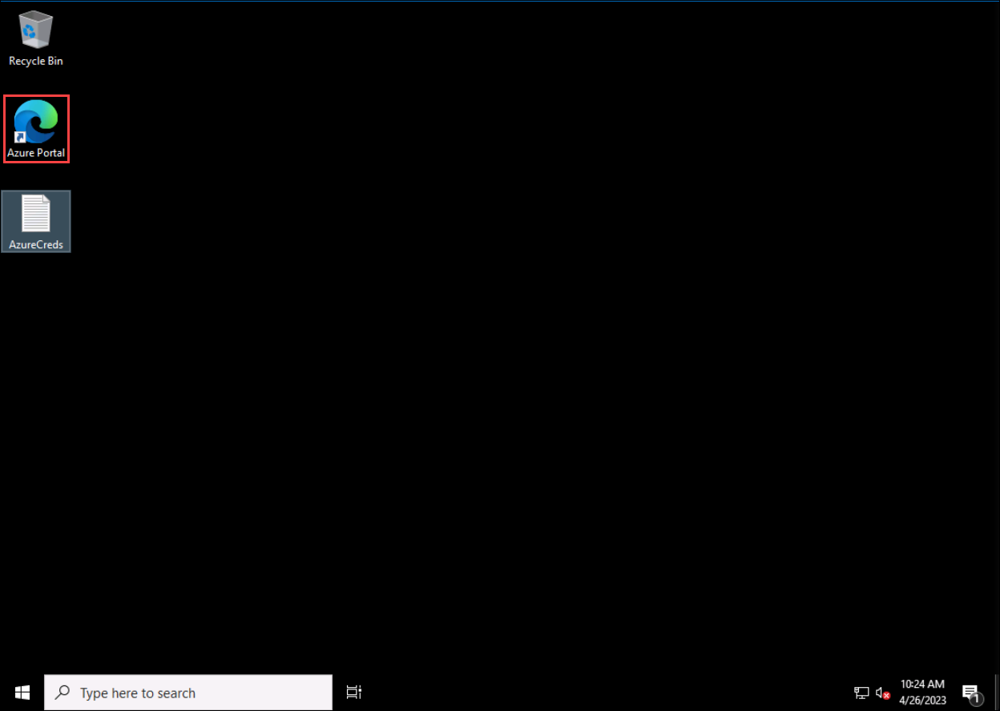
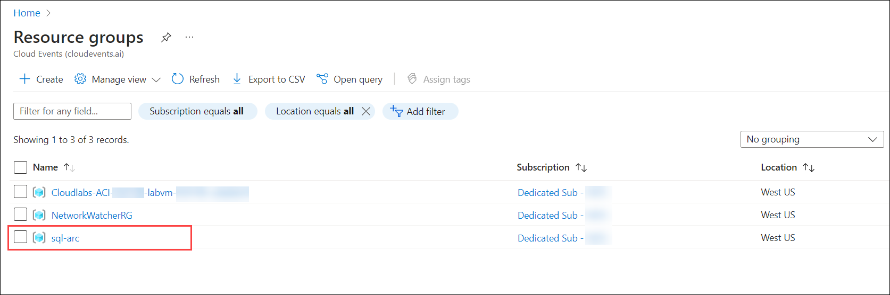

# Azure Arc-enabled SQL Server Workshop

## Overview

Contoso, a global retail company, operates SQL Server databases across various on-premises data centers and remote locations. To streamline management and enhance visibility, Contoso participates in the Azure Arc-enabled SQL Server workshop. The workshop guides Contoso through the process of connecting their SQL Server instances to Azure Arc, enabling unified management through the Azure portal.

The Azure Arc-enabled SQL Server workshop demonstrates how to extend Azure management capabilities to SQL Server instances running on-premises or in other cloud environments. By leveraging Azure Arc, you can centrally manage and govern SQL Server deployments with Azure’s tools and services, regardless of their location.

## Objective

In the hands-on labs, you'll first onboard your on-premises SQL Server instances to Azure Arc, enabling centralized management through the Azure portal. The initial exercise covers connecting a general SQL Server, while the second focuses specifically on integrating SQL Server 2012, ensuring compatibility with older versions. Finally, you'll create a unified management dashboard, or "single pane of glass," that aggregates monitoring and management capabilities across all your SQL Server instances, providing a streamlined view and control of your entire SQL Server environment.

1. **Onboard the On-prem SQLServer to Azure Arc-enabled SQL Server:** Connects on-premises SQL Server instances to Azure Arc for centralized management. Participants will successfully connect their on-premises SQL Server instances to Azure Arc, enabling centralized management and visibility from the Azure portal.

1. **Onboard the On-prem SQLServer 2012 to Azure Arc-enabled SQL Server:** Integrates SQL Server 2012 with Azure Arc, ensuring compatibility with older SQL Server versions. Participants will integrate SQL Server 2012 with Azure Arc, allowing them to manage and monitor older SQL Server instances through Azure’s management tools.

1. **Create a Single pane of glass-managed solutions with Azure Arc:** Configures a unified management dashboard in Azure to oversee all SQL Server instances from a single interface. Participants will configure a unified management dashboard in Azure, providing a comprehensive view and control over all their SQL Server instances from a single, centralized interface.

## Getting Started with Lab

1. You can see a virtual machine desktop 💻 (**LABVM**) is loaded on the left side in your browser. Use this virtual machine throughout the workshop to perform the lab. You can also connect to the virtual machine using any RDP client using the **LABVM** credentials provided in the **Environment Details** tab.

    
   
   >Note: If you see any PowerShell windows running in your VM, please do not close that as it's setting up some configurations inside the environment.
 
1. To get the lab environment details, you can select the **Environment Details** tab. Additionally, the credentials will also be emailed to your registered email address. You can also open the Lab Guide in a separate and full window by selecting the **Split Window** from the lower right corner. Also, you can start, stop and restart virtual machines from the **Resources** tab.

   
 
   > You will see the SUFFIX value on the **Environment Details** tab, use it wherever you see SUFFIX or DeploymentID in lab steps.
 
## Login to Azure Portal

1. In the JumpVM, click on the Azure portal shortcut of the Microsoft Edge browser which is created on the desktop.

   
   
1. On the **Sign in to Microsoft Azure** tab you will see the login screen, in that enter the following email/username, and click on **Next**. 

   * **Email/Username**: <inject key="AzureAdUserEmail"></inject>
   
      
     
1. Now enter the following password and click on **Sign in**.
   
   * **Password**: <inject key="AzureAdUserPassword"></inject>
   
      
     
1. If you see the pop-up **Stay Signed in?**, select **No**.

1. If you see the pop-up **You have free Azure Advisor recommendations!**, close the window to continue the lab.

1. If a **Welcome to Microsoft Azure** popup window appears, select **Maybe Later** to skip the tour.
   
1. Now you will see the Azure Portal Dashboard, click on **Resource groups** from the Navigate panel to see the resource groups.

   
   
1. Confirm that you have all resource groups present as shown below.

   
   
1. Now, click on **Next** from the lower right corner to move on to the next page.
